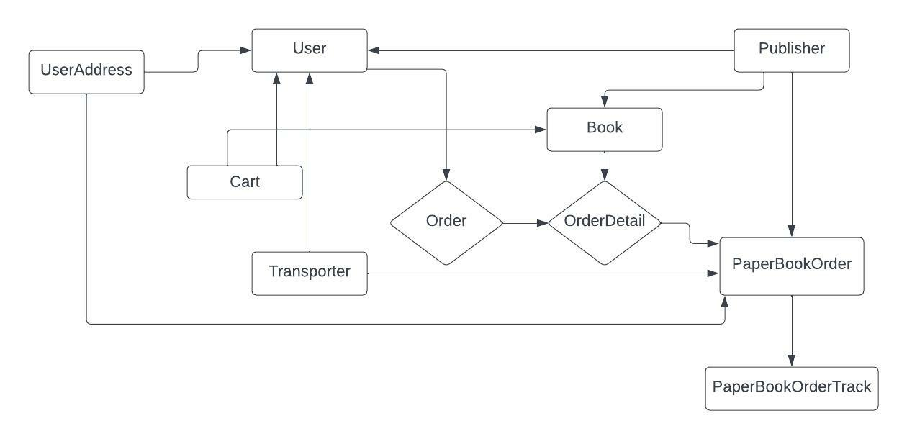

## quick install

git clone git@github.com:dilipen/book-track.git

cd book-track

pip install -r requirements.txt

## db desing

## create users

python .\manage.py create_buyer "buyer1" "buyer1@mail.com" "buyer1" "address_line1" "address_line2" "address_line3"

python .\manage.py create_buyer "buyer2" "buyer2@mail.com" "buyer2" "address_line1" "address_line2" "address_line3"

python .\manage.py create_buyer "buyer3" "buyer3@mail.com" "buyer3" "address_line1" "address_line2" "address_line3"
  

python .\manage.py create_publisher "pub1" "pub1@mail.com" "pub1" 

python .\manage.py create_publisher "pub2" "pub2@mail.com" "pub2" 

python .\manage.py create_publisher "pub3" "pub3@mail.com" "pub3" 
  

python .\manage.py create_transporter "tran1" "tran1@mail.com" "tran1" 

python .\manage.py create_transporter "tran2" "tran2@mail.com" "tran2" 

python .\manage.py create_transporter "tran3" "tran3@mail.com" "tran3" 
  
